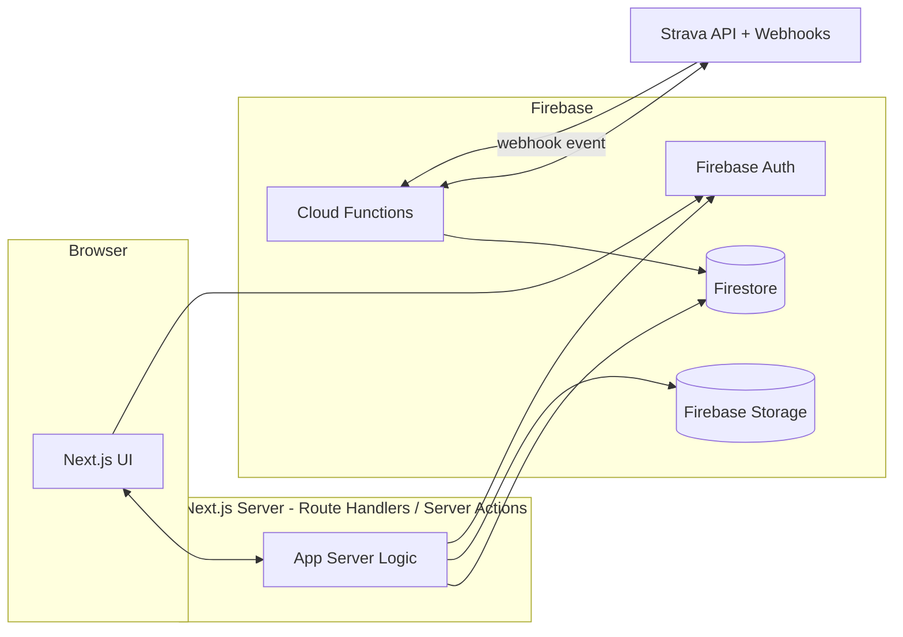
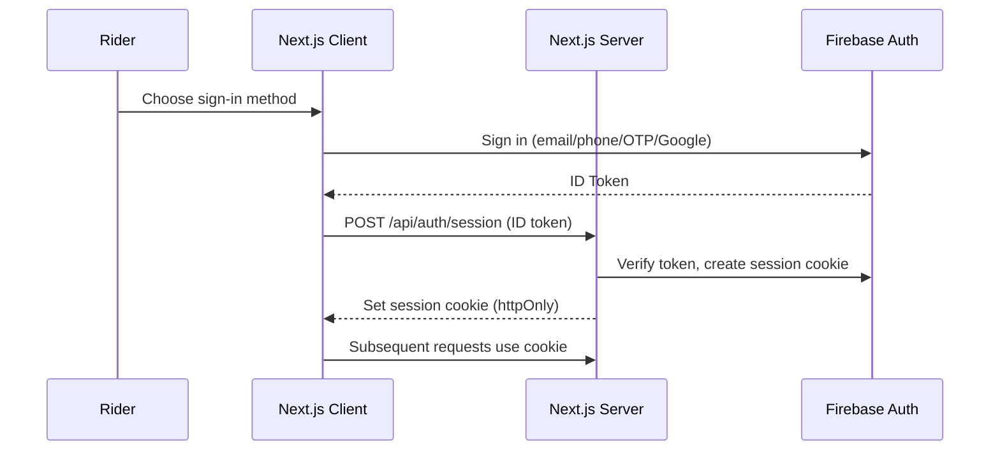

# Cycle Network Grow — Architecture

This document translates [REQUIREMENTS.md](./REQUIREMENTS.md) into a concrete
technical design: system structure, data flow, and folder layout. It will
evolve as open questions in the requirements doc get resolved.

## 1. Architecture Style

- **Next.js (App Router)** as the single application — server components for
  data-heavy pages (events, leaderboards, admin), client components for
  interactive bits (forms, OTP input, leaderboard live updates).
- **Hosting: Firebase App Hosting, single platform, single project.**
  Chosen over Vercel per client constraint — billing is already set up on
  Firebase/GCP, and expected scale is under 500 users, well within what a
  single-platform Firebase setup handles comfortably. Firebase App Hosting
  is Firebase's current GA product for Next.js SSR (it superseded the
  older "Hosting + Cloud Functions frameworks" experiment, which Google
  closed to new projects) — it's backed by Cloud Run, supports App Router
  (Server Components, Server Actions, middleware) natively, and has
  built-in GitHub integration for CI/CD rollouts. Using it means the app
  and all backend services (Auth, Firestore, Functions, Storage) live in
  one Firebase project with one deploy pipeline — no cross-platform env var
  wiring between Vercel and Firebase. This resolves the hosting open
  question from REQUIREMENTS.md §7.3 — see §11 for details.
- **Firebase** as the backend platform:
  - **Firebase Auth** — all platform sign-in methods.
  - **Firestore** — primary data store.
  - **Cloud Functions** — Strava webhook receiver, token refresh, scheduled
    sync jobs, anything that must run server-side outside a request/response
    cycle.
  - **Firebase Storage** — event banners, product images, rider/testimonial
    photos.
- Next.js talks to Firebase via the **Admin SDK on the server** (Route
  Handlers / Server Actions) for anything privileged (writing scores,
  reading Strava tokens, admin operations). The **client SDK** is used only
  for what's safe client-side: Auth sign-in flows and reading public,
  non-sensitive data directly from Firestore where convenient.

## 2. High-Level System Diagram



## 3. Route Structure (Next.js App Router)

```
app/
  (public)/
    page.tsx                 -> Home page (3.7)
    events/
      page.tsx                -> Events list
      [eventId]/page.tsx       -> Event detail + leaderboard
    shop/                      -> Community gear (scope pending)
  (auth)/
    login/page.tsx
    signup/page.tsx
    otp/page.tsx
  (rider)/                     -> requires authenticated rider
    profile/page.tsx
    profile/strava/page.tsx    -> connect/disconnect Strava
    my-events/page.tsx
    profile/reviews/page.tsx    -> submit a testimonial
  admin/                       -> requires admin custom claim (real URL
                                   segment, NOT a route group — see note)
    dashboard/page.tsx
    events/                    -> create/edit events
    events/[eventId]/teams/     -> team roster mgmt + CSV/sheet import, max-members cap
    events/[eventId]/offline-results/
    events/[eventId]/documents/ -> upload/link documents to this event
    riders/                    -> rider management
    riders/strava/              -> Strava-connected riders list, revoke connection
    rides/cleanup/               -> bulk view/delete a rider's synced ride data
    rides/flag/                  -> per-rider ride browsing + flag/cheat/type moderation
    strava-subscription/         -> view + manual create/delete of the webhook subscription
    endurance/riders/            -> named-program rider registry CRUD (3.9)
    endurance/rules/             -> named-program medal/points rule sets (3.9)
    documents/                  -> document library (unlinked + linked)
    content/                   -> quotes, testimonials, products, partners
    content/reviews/            -> approve/discard submitted testimonials
    content/home-sections/      -> section visibility toggles
    content/instagram/           -> curated Instagram post list (add/remove/reorder)
    audit-log/
```

> **Fixed from an earlier draft of this doc**: admin was originally written
> as a `(admin)` route group. Route groups (parenthesized folders) are
> **invisible in the URL** — so `(public)/events/page.tsx` and
> `(admin)/events/page.tsx` would both resolve to `/events` and collide,
> which Next.js rejects at build time. Admin routes live under a real
> `admin/` URL segment instead (`/admin/events`, `/admin/riders`, etc.) —
> this also gives Proxy a trivial matcher (`/admin/:path*`) and matches the
> current Angular app's own `/admin/...` convention. `(public)`, `(auth)`,
> `(rider)` stay as true route groups since their leaf paths don't collide
> with anything.

Added rows above (`events/[eventId]/teams`, `riders/strava`, `rides/cleanup`,
`rides/flag`, `strava-subscription`, `endurance/*`, `content/instagram`)
carry over admin tools found in the current Angular app
(`admin-settings/*`) that the original route list omitted — see
REQUIREMENTS.md §3.5, §3.9 for what each does.

Route groups `(public)`, `(auth)`, `(rider)`, and the real `admin/` segment
map to the access-control boundaries in REQUIREMENTS.md §2, but — see §4
below — the shared `layout.tsx` for `(rider)`/`admin/` is **not** where
enforcement happens; Next.js
does not re-run a layout on client-side navigation between sibling routes
under it (see "Layouts and auth checks" in §4), so a role check placed only
in the layout can be skipped on some navigations. Enforcement lives in the
**Data Access Layer** (§4), called from each page/Server Action/Route
Handler individually. The layout may still do a cheap, non-authoritative
redirect for a snappier UX, but it is not the security boundary.

## 4. Authentication Architecture

> **Terminology note (Next.js 16):** what was called "Middleware" through
> Next.js 15 is renamed **Proxy** in 16 (`proxy.ts`, same file-convention
> idea, functionally equivalent) — see
> [nextjs.org/docs/app/getting-started/proxy](https://nextjs.org/docs/app/getting-started/proxy).
> More importantly, Next's own authentication guide is explicit that Proxy
> is for **optimistic checks only** ("it should not be used as a full
> session management or authorization solution") and recommends a
> **Data Access Layer (DAL)** as the actual enforcement point. The design
> below follows that guide directly rather than the informal
> "middleware + recheck" pattern in the original draft of this doc.

- Firebase Auth handles all four sign-in methods (email+OTP, phone+OTP,
  email/phone+password, Google) — see REQUIREMENTS.md §3.1.
- On successful sign-in, the client obtains a Firebase ID token; the server
  exchanges it for a **session cookie** (Firebase Admin SDK
  `createSessionCookie`) so Server Components/Route Handlers can read auth
  state without re-verifying an ID token on every request.
- **Role** (`rider` / `admin`) is stored as a **Firebase custom claim** on
  the user, set via a Cloud Function (never client-writable) — included in
  the session cookie's decoded claims once set.
- **Account linking**: Firebase Auth's built-in account linking is used
  where the identifier (verified email/phone) matches an existing account,
  per REQUIREMENTS.md §3.1.
- **Two-layer protection, per Next's recommended pattern:**
  1. **`proxy.ts` — optimistic check.** Runs on every matched request
     (Node.js runtime, so the Admin SDK is usable here if needed). It
     decodes the session cookie's JWT **without a revocation check** (a
     signature-only verify, no network/Firestore call) and redirects
     obviously unauthenticated or wrong-role requests before a protected
     page renders. Deliberately cheap — Next's guide warns against slow
     checks in Proxy since it also runs on prefetched routes. This is a
     fast first gate and a UX nicety, **not** the security boundary.
  2. **Data Access Layer (DAL) — the actual enforcement.** A
     `lib/auth/dal.ts` exports a `verifySession()` function, wrapped in
     React's `cache()` so it runs once per request even when called from
     multiple components, that: reads the session cookie, calls Firebase
     Admin SDK `verifySessionCookie(cookie, /* checkRevoked */ true)` (the
     full check, including revocation — the expensive call skipped in
     Proxy), and either returns `{ uid, role }` or calls `redirect()`.
     **Every** page component, Server Action, and Route Handler that
     touches privileged or per-user data calls `verifySession()` itself —
     not just once in a shared layout. This is what actually closes the
     access-control gap, since Proxy's checks are skippable (direct Route
     Handler calls bypass page-level Proxy logic if the matcher doesn't
     cover them) and layouts don't reliably re-run per navigation.
  3. **Data Transfer Objects (DTOs)**: functions that return data to the
     client return only the fields needed for that view (e.g. a rider
     profile read never includes the full Firestore `stravaTokens` doc),
     per Next's DTO recommendation — this is the same principle as the
     `stravaTokens` client-read-denial rule in §9, applied consistently to
     every privileged read, not just that one collection.
  4. **This closes a real gap in the current app, not a theoretical one.**
     `letscng-api/functions` has zero server-side authorization — every
     Express route in `routes/*.js` is reachable by anyone who knows the
     URL; the only admin gate today is a client-side phone-number check in
     Angular (`AdminService.isAdminUser()`), which is trivially bypassed by
     calling the API directly. Every admin route listed in §3 and §7.1–7.2
     must call `verifySession()` and check the role before touching data,
     since there is no legacy protection to fall back on and Proxy alone
     does not provide it.
- **Deploy-time check, not yet verified (we're local-only for now):**
  confirm Firebase App Hosting's Next.js adapter supports the `proxy.ts`
  convention (vs. still expecting the pre-16 `middleware.ts` name) before
  we actually deploy to `challenge1177` — Next.js 16 is recent enough that
  hosting-adapter support can lag, same caveat as the Next.js version
  question in REQUIREMENTS.md.



## 5. Strava Integration Architecture

- **Connect flow**: rider (already logged into the platform) initiates
  Strava OAuth from their profile. Redirect → Strava consent → callback hits
  a Next.js Route Handler → exchange code for access/refresh token → store
  in `stravaTokens` (server-only, never sent to client).
- **Global sync switch → real Strava subscribe/unsubscribe.** Strava only
  allows **one webhook subscription per application** (not per athlete,
  not per event) — which is actually a clean match for a single global
  admin toggle:
  - `platformSettings/global`: `{ stravaSyncEnabled: boolean, updatedBy,
    updatedAt }`. Only writable by Admin.
  - Flipping it to **ON** triggers a Cloud Function that calls Strava's
    **Create Push Subscription** API, registering our callback endpoint.
  - Flipping it to **OFF** triggers a Cloud Function that calls Strava's
    **Delete Push Subscription** API, removing it.
  - When OFF, Strava has nothing to push to — this is a real disconnect
    (zero events arrive, zero API calls happen), not just us ignoring
    incoming pings. Matches "turn it off between events" literally.
- **Sync on webhook event** (only fires at all while the switch is ON):
  1. Cloud Function receives the event (athlete ID, activity ID,
     aspect_type) and **responds `200` immediately** — Strava expects a
     fast ack; processing happens asynchronously afterward so a slow
     downstream step never causes Strava to treat the event as failed.
  2. **Attribution check**: look up whether this athlete is currently an
     `eventParticipants` entry for an event that is `status: active` and
     within its start/end window. If not, stop here — this activity
     doesn't belong to any running event, nothing is stored. (This is
     about *which event a ride counts toward*, not a permission gate —
     the global switch already decided whether we're listening at all.)
  3. Fetches full activity details from Strava API (refreshing the token
     first if expired).
  4. Confirms the activity's date/type still qualifies for that specific
     event (activity type filter, event window).
  5. Writes/updates the `activities` doc.
  6. Triggers a leaderboard recompute for the affected event (see §6).
- **Backfill/polling job**: a scheduled Cloud Function runs periodically as
  a safety net in case webhook delivery is missed — Strava retries a
  webhook delivery up to 3 times but does **not** redeliver events beyond
  that, so a periodic reconciliation pass is necessary, not just
  nice-to-have (per REQUIREMENTS.md §3.2). This job also checks
  `stravaSyncEnabled` first and **skips entirely if OFF**, so a paused
  period truly makes zero Strava calls.
- **Token refresh**: handled lazily (on-demand before an API call) and/or
  via a scheduled job for tokens nearing expiry.
- **Admin manual sync tools** (carried over from the current app's
  "pull missing rides" / "Strava subscription" tools, missing from the
  original draft):
  - A `POST` Route Handler lets admin trigger an on-demand backfill for one
    rider (bypassing the wait for the next scheduled job) — same
    fetch/filter/write logic as the scheduled backfill, just invoked
    per-rider on demand.
  - A `GET` Route Handler reports the current Strava push-subscription
    state (calls Strava's `GET push_subscriptions`) so admin can confirm the
    global switch actually took effect, plus manual create/delete as a
    troubleshooting fallback if the automatic subscribe/unsubscribe in the
    switch flow fails.
  - **Both must run server-side only.** The current Angular app calls
    Strava's API directly from the browser using the app's client secret
    embedded in `environment.ts` — that secret must never ship in Next.js
    client bundles; these tools call Strava from a Route Handler/Cloud
    Function using a server-only secret (env var / Secret Manager).
- **Rate limits** (as of Strava API docs): app-wide default ~200
  requests/15 min and 2,000/day (15-minute window resets on the clock at
  :00/:15/:30/:45). Design implications:
  - Webhooks (not polling) are the primary sync path specifically to avoid
    burning this budget per-athlete.
  - Batch reads with `per_page=200` where fetching multiple activities.
  - Apply **exponential backoff with jitter** on `429` responses.
  - If rider count grows large enough that the default limit is tight,
    Strava supports requesting a rate-limit increase — worth planning for
    once real usage numbers exist, not at initial build.

## 6. Leaderboard Computation

**Decision: compute on write, one entry doc per rider per event** (not a
single denormalized array doc). Leaderboards are read far more often than
activities are written, so pushing the aggregation cost to write-time keeps
the leaderboard page fast — but the entries must be split across documents,
not stored as one big array, to avoid two real problems with a single
`leaderboard/{eventId}` doc:

- **Hot-document contention**: Firestore documents have a practical write
  throughput ceiling (~1 sustained write/sec); an active event with many
  riders finishing rides concurrently would serialize/contend on one doc.
- **Real-time listener granularity**: a single array doc means *any*
  rider's update re-sends the *entire* leaderboard to every listening
  client; per-entry docs let Firestore's listeners diff efficiently.

**Structure**: `leaderboards/{eventId}/entries/{uid}` — one doc per
rider (or team) per event, containing their current aggregate score(s) and
`updatedAt`. A Cloud Function updates only the affected rider's entry doc
whenever their `activities` change (webhook or exclusion by admin). The
leaderboard page runs `orderBy(scoreField, 'desc').limit(n)` over the
`entries` subcollection, optionally with a real-time `onSnapshot` listener
for live updates during an active event. Team leaderboards, if `teamMode`
is on, get a parallel `leaderboards/{eventId}/teamEntries/{teamId}`
subcollection aggregated the same way.

This still depends on the scoring formula (REQUIREMENTS.md open question 1)
to know exactly what fields go into each entry doc — the write pattern
above holds regardless of which formula is chosen.

## 7. Admin Panel — Impersonation

- Admin "login as rider" uses the Firebase Admin SDK to mint a **custom
  token** for the target rider, scoped and short-lived.
- Every impersonation start/end is written to `auditLog` (who, target,
  timestamp), per REQUIREMENTS.md §2.2 / §3.5.
- The UI must clearly indicate "viewing as [rider]" mode and provide an
  obvious way to exit back to the admin session.

## 7.1 Admin Panel — Ride Data Tools

Carried over from the current Angular app's `clean-rides`, `manage-strava-
users`, and `flag-cheat-rides` admin screens, none of which appeared in the
original draft:

- **Ride cleanup**: list riders who have synced ride data; bulk-delete a
  rider's (or several riders') `activities` docs — a maintenance/reset
  action, gated behind the admin custom claim and written to `auditLog`
  like any other destructive admin action.
- **Strava-connected riders list**: a server-side query joining `users`
  (`stravaConnected: true`) with `stravaTokens` metadata (connection date,
  athlete ID — never the tokens themselves) for an admin list view, plus a
  "revoke" action that deletes the `stravaTokens` doc and flips
  `stravaConnected` to false for that rider (same effect as the rider
  disconnecting themselves in 3.1, triggerable by admin).
- **Ride flagging/moderation**: for a chosen rider, list their full
  `activities` history (not just one flagged item) and let admin toggle
  `excluded`/`cheated` or correct `activityType` per activity before
  leaderboard recompute — an expansion of the single-activity exclude flow
  in §6, needed because the original draft only specified excluding one
  activity at a time from a leaderboard view, not rider-level review.

## 7.2 Admin Panel — Team Rosters (Team-Mode Events)

Carried over from the current app's `aw80-control-panel` (currently
hardcoded to one event's team structure — generalized here so it applies to
any team-mode event, per REQUIREMENTS.md §3.5):

- `teams/{teamId}` gains a `maxMembers` field, set per event when team mode
  is configured (3.3).
- Admin can add/remove riders to/from a team individually, or **bulk-import**
  a roster — e.g. upload a CSV (or paste rows) of phone numbers/rider IDs
  and target team, validated against `maxMembers` before writing
  `eventParticipants` + `teams.memberIds`. This replaces the current app's
  Google-Sheet-only import path with a generic file upload, so it isn't
  tied to one external spreadsheet.

## 8. Content Management: Documents, Home Page Sections, Reviews

### 8.1 Document Uploads

- Admin uploads a file (PDF/image) through the Admin Panel → file goes to
  **Firebase Storage** (not Firestore — Firestore documents cap out at 1MB
  and aren't meant for binary blobs); Firestore only stores a **reference**
  to it.
- On successful upload, a `documents/{documentId}` doc is written with the
  Storage path/URL, file name, MIME type, `uploadedBy`, `uploadedAt`, and
  an optional `linkedEventIds: string[]`.
- Linking to an event is just adding/removing that event's ID from
  `linkedEventIds` — a document can be linked to multiple events or none.
- The event detail page queries `documents` where `linkedEventIds` contains
  the current `eventId` to render its attached files.
- Storage security rules: uploads/deletes require the admin custom claim;
  reads are public if the linked event is public (documents aren't
  sensitive data like Strava tokens).

### 8.2 Home Page Section Visibility

- A single `siteConfig/homePage` doc holds a boolean per section: `hero`,
  `motivation`, `upcomingEvents`, `shop`, `socialMedia`, `testimonials`,
  `partners`.
- The home page Server Component reads this doc once per render and
  conditionally renders each section — turning a section off means it's
  skipped entirely (no empty placeholder), not just visually hidden.
- Admin-only writes; public read (needed so the public home page can render
  without an authenticated request).

### 8.3 Review Moderation (Testimonials)

- A rider submits a testimonial from their profile → written to
  `testimonials/{id}` with `status: 'pending'`, `submittedBy: uid`,
  `submittedAt`.
- Admin Panel shows a queue of `status == 'pending'` docs; approving sets
  `status: 'approved'`, `reviewedBy`, `reviewedAt`; discarding sets
  `status: 'discarded'` (kept for record, not deleted).
- The home page testimonials section queries only `status == 'approved'`.
- Firestore rules: a rider can create their own testimonial doc (status
  forced to `pending` server-side, not client-settable) but cannot set
  `status` to `approved` themselves; only Admin SDK/Cloud Function writes
  can transition status.

### 8.4 Social Media (Instagram)

- **Revised from the original draft** to match the current site's actual
  admin tool (see REQUIREMENTS.md §3.7.6): admin maintains an ordered list
  in `instagramPosts` (post URL/embed code, `order`), managed via
  add/remove/reorder in the Admin Panel — no Instagram API credentials
  needed, but it's admin-curated data in Firestore, not an unmanaged embed
  widget. The home page renders each entry (e.g. via Instagram's public
  oEmbed for a given post URL) in `order`.
- Deferred to a later iteration: native Instagram Graph API integration
  (auto-pulling recent posts instead of admin pasting links) if pulling
  posts automatically becomes a real need.

### 8.5 Named Programs (e.g. East Endurance)

Carried over from the current app's `users-control`/`endurance-control`
admin tools (REQUIREMENTS.md §3.9) — not in the original draft, which only
had the generic event/leaderboard model:

- `enduranceRiders/{id}`: `name`, `psnId`, `gender`, `bikeType` (`road` |
  `mtb`), `phone` — a registry independent of `users`, since a rider can be
  in this program without a full platform login.
- `enduranceRules/{id}`: `eventId`, per-category (`bikeType` × `gender`)
  cutoff times for `gold`/`silver`/`bronze` and a points value per tier.
- Result computation reads a rider's raw time/distance (from `activities` or
  `offlineResults`), looks up the matching `enduranceRules` entry for that
  rider's category, and derives a medal tier + points — a separate
  computation path from the generic scoring in §6, feeding a
  program-specific leaderboard view rather than the standard
  `leaderboards/{eventId}/entries` shape.
- Kept as a distinct, purpose-built admin module rather than folded into the
  generic event model, since REQUIREMENTS.md §3.9 leaves "generic program
  builder" as an open question, not a v1 requirement.

### 8.6 Per-Event Bespoke Rendering

Per REQUIREMENTS.md §3.10 (open decision, default = keep bespoke pages):
if confirmed, implement as a **slug → component registry** instead of the
current app's copy-pasted `ngSwitch` — e.g. `app/(public)/events/[slug]/
page.tsx` looks up `slug` in a `eventRenderers` map (TypeScript object
mapping known slugs to a specific React component); unmatched slugs fall
back to the generic event-detail template (rules tabs + standard
leaderboard). This keeps the same "each named event can have bespoke
UI/logic" capability the current admin tools depend on (AW80D team
structure, East Endurance medal rules) while avoiding the original
`ngSwitch`'s need to touch a shared file for every new edition — a new
edition still gets its own component, but registration is a one-line map
entry, not a growing conditional.

## 8.7 Caching Strategy

Not addressed in the original draft — needed because Next.js App Router
caches aggressively by default, and this app has a mix of content that
should be cached hard and content that must never be stale or shared across
users.

> **Next.js 16 has two caching models**, and this matters for what code to
> actually write: the **previous model** (fetch-cache options, `dynamic`
> route segment config, `revalidateTag`/`revalidatePath`, a route
> automatically going dynamic the moment it calls `cookies()`/`headers()`)
> vs. the newer opt-in **Cache Components** model (`cacheComponents: true`
> in `next.config.ts`, the `"use cache"` directive, `cacheLife()`,
> `cacheTag()`, `updateTag()`) which requires wrapping every dynamic/runtime
> read in `<Suspense>` and is Next's recommended direction for "instant
> navigation" static shells. **Decision for v1: use the previous model.**
> Cache Components' benefit (prerendered static shells with dynamic holes)
> mainly pays off for the public marketing-style pages, but it requires
> Suspense-boundary discipline throughout the tree and is a bigger paradigm
> shift than this app's <500-user scale needs right now. Revisit as a
> follow-up optimization once the app is functionally complete — not a v1
> blocker. Everything below assumes the previous model (`cacheComponents`
> left `false`/unset).

- **Public, admin-edited content** (home page sections §3.7, events
  list/detail metadata §3.3, documents §3.8, partners/quotes/testimonials,
  Instagram list §8.4): rendered by **Server Components using tagged
  fetches / `unstable_cache`**, cached indefinitely, and invalidated with
  **on-demand revalidation** (`revalidateTag`/`revalidatePath`) called from
  the same admin Route Handler that writes the change — e.g. saving
  `siteConfig/homePage` calls `revalidateTag('home')` right after the
  Firestore write. This avoids both stale content (no fixed revalidate
  interval to wait out) and hammering Firestore on every home page view.
- **Leaderboards** (§6): **never** go through the fetch/data cache —
  fetched with `cache: 'no-store'` (or read directly Firestore-side) and
  updated live via a client-side `onSnapshot` listener during an active
  event, per §6's own reasoning (per-entry docs so listeners diff
  efficiently). Caching a leaderboard, even briefly, defeats the point of
  webhook-driven near-real-time updates in §5.
- **Anything behind the session cookie** (all `(rider)` and `(admin)` route
  groups, and any Route Handler that calls `cookies()`/verifies the session)
  is **inherently dynamic** — Next.js opts a route out of static rendering
  and the full route cache automatically the moment it reads `cookies()` or
  `headers()`, but admin/rider Route Handlers should still set
  `export const dynamic = 'force-dynamic'` explicitly rather than rely on
  that inference, so a future refactor can't silently reintroduce caching
  on a route serving per-user or privileged data (rider profile, admin
  dashboards, Strava-connected-riders list, ride flagging, etc.).
- **Mutation Route Handlers** (`POST`/`PATCH`/`DELETE` — event CRUD, ride
  flags, team roster writes, endurance registry/rules, manual backfill
  trigger): Next.js does not cache these by method, but set
  `dynamic = 'force-dynamic'` anyway for consistency and to guard against
  any GET-based read endpoints among them (e.g. a `GET` that lists riders)
  being accidentally cached.
- **Deployment caveat (Firebase App Hosting):** App Hosting runs Next.js on
  Cloud Run, which can scale to multiple instances — Next.js's *default*
  in-memory Data Cache is per-instance, not shared. For this app's scale
  (<500 users, per ARCHITECTURE.md §1) that's acceptable for the
  admin-edited content above (worst case: one instance briefly serves a
  just-revalidated page from a stale in-memory copy until its own cache
  entry is invalidated) — not worth adding a custom shared cache handler
  (e.g. Cloud Storage-backed) at v1. Revisit only if instance count or
  staleness tolerance changes.

## 9. Data Model (Firestore)

Expands REQUIREMENTS.md §6 with field-level detail; still subject to change.

- `users/{uid}`: `role`, `displayName`, `email`, `phone`, `photoURL`,
  `stravaConnected: boolean`, `createdAt`.
- `stravaTokens/{uid}`: `accessToken`, `refreshToken`, `expiresAt`,
  `athleteId` — **Firestore security rules deny all client reads/writes**;
  only Admin SDK (server/Cloud Functions) touches this collection.
- `cyclingEvents/{eventId}` — **not** `events`. That name is already used by
  the live production Angular/Express app's own events collection (27 real
  events as of writing — AW80D, East Endurance, CNG1177, etc. — with a
  completely different, incompatible schema: `path`, `rules`,
  `configuration`, `payment_link`, `riders`, `eastEnduranceRules`). Two
  verification documents briefly landed in the legacy collection during
  development before this was caught and fixed — same class of naming
  collision already called out for `users` vs. the legacy `user_data`/
  `riders` collections; worth double-checking against the legacy collection
  list (§ live-project reconnaissance) before naming any new collection.
  Current fields (a leaner first cut, not yet the fuller shape below): `id`,
  `name`, `description`, `category`, `startDate`, `endDate`, `location`,
  `distanceKm`, `difficulty`, `status` (`draft`/`active`/`completed`/
  `archived`), `createdBy`, `createdAt`. Only `status: 'active'` events with
  a future `endDate` show on the public home page. Planned fuller shape
  (not yet implemented): `bannerUrl`, `mode: 'online' | 'in_person'`,
  `location` as a structured name/address (present when in-person),
  `activityTypes`, `scoringMethod`, `teamMode`, `joinMethod`,
  `featuredParticipantIds`.
- `teams/{teamId}`: `eventId`, `name`, `memberIds`.
- `eventParticipants/{eventId}_{uid}`: `eventId`, `uid`, `teamId?`,
  `joinedAt`.
- `activities/{activityId}`: `uid`, `eventId`, `stravaActivityId`,
  `distance`, `elevationGain`, `movingTime`, `startDate`, `excluded: boolean`.
- `leaderboards/{eventId}/entries/{uid}` (+ `teamEntries/{teamId}`):
  per-rider/team aggregate score docs, regenerated on activity change — see
  §6 for why this is a subcollection rather than one array doc.
- `offlineResults/{eventId}_{uid}`: manually entered metrics + `enteredBy`.
- `auditLog/{logId}`: `actorUid`, `action`, `targetUid?`, `timestamp`,
  `details`.
- `quotes`, `products`: home page content, per REQUIREMENTS.md §3.7.
- `partners/{partnerId}`: `logoUrl`, `name`, `link?`, `order` — home page
  partner logo strip, per REQUIREMENTS.md §3.7.
- `testimonials/{id}`: `quote`, `photoUrl?`, `relatedEventId?`,
  `submittedBy: uid`, `submittedAt`, `status: 'pending' | 'approved' |
  'discarded'`, `reviewedBy?`, `reviewedAt?` — see §8.3.
- `documents/{documentId}`: `storagePath`, `fileName`, `mimeType`,
  `uploadedBy`, `uploadedAt`, `linkedEventIds: string[]` — see §8.1.
- `siteConfig/homePage`: boolean per section (`hero`, `motivation`,
  `upcomingEvents`, `shop`, `socialMedia`, `testimonials`, `partners`) —
  see §8.2.
- `platformSettings/global`: `stravaSyncEnabled: boolean`, `updatedBy`,
  `updatedAt` — the single global Strava sync switch (§5).
- `instagramPosts/{id}`: `url`, `order` — curated home page post list, see
  §8.4.
- `enduranceRiders/{id}`, `enduranceRules/{id}`: named-program registry and
  scoring rules, see §8.5.
- `teams/{teamId}` (extended): add `maxMembers` per §7.2.

All of the above admin-only collections (ride cleanup deletes, Strava
connection revokes, ride flags, team roster writes, endurance registry/rule
CRUD, Instagram list edits) go through the Admin SDK/Route Handlers with the
same server-side role check as every other admin write — see §4 and the
security note below.

Firestore **security rules** follow the principle: riders can read public
collections and their own docs; riders may *create* their own
`testimonials` doc (status forced server-side) but not approve it; all
writes to `events`, `activities` (exclusion flag), `documents`,
`siteConfig`, `auditLog`, `platformSettings`, testimonial status changes,
and all access to `stravaTokens` go through the Admin SDK / Cloud Functions
only, never direct client writes.

## 10. Repo / Project Structure (once code starts)

```
app/                  # Next.js App Router routes (see §3)
components/           # Shared UI components
lib/
  firebase/            # client + admin SDK init
  strava/              # Strava API client, token refresh helpers
  auth/                # session helpers, role checks
functions/             # Firebase Cloud Functions (webhook, sync, scheduled jobs)
docs/
  REQUIREMENTS.md
  ARCHITECTURE.md
```

Exact conventions (naming, testing setup, linting) to be settled when the
project is scaffolded.

## 11. Environments & Deployment

- **Everything on one Firebase project** (per environment — see below):
  the Next.js app runs on **Firebase App Hosting** (Cloud Run under the
  hood), alongside Auth, Firestore, Storage, and Cloud Functions in the
  same project. The app talks to Firestore/Auth Admin SDK using the
  project's own service account automatically — no manual credential
  wiring across platforms.
- **Target project (decided): `challenge1177`** — currently hosts only
  `letscng-ui` (the Angular frontend); Functions/Firestore for this rebuild
  will be consolidated into it too, retiring the separate
  `firebase-api-cng` project the current backend uses. **Not wired up yet**
  — initial development runs against the **Local Emulator Suite only**
  (below); connecting to `challenge1177` for real (via `.firebaserc`,
  `firebase use`) happens when we're ready to deploy, not at scaffold time.
- **CI/CD**: Firebase App Hosting connects directly to the GitHub repo;
  pushes to the configured branch trigger an automatic build + rollout.
  Cloud Functions deploy via the Firebase CLI (`firebase deploy --only
  functions`), which can run in the same GitHub Actions workflow.
- **Environments**: local dev using the **Firebase Local Emulator Suite**
  (Auth, Firestore, Functions) so development doesn't touch production
  data or burn Strava API quota; separate Firebase projects for
  staging/production, each with its own App Hosting backend and its own
  Strava API app credentials (Strava webhook callback URLs differ per
  environment).
- Exact CI/promotion flow (e.g. GitHub Actions running emulator-backed
  tests before allowing App Hosting's auto-rollout, or gating Cloud
  Functions deploys) to be set up when the repo is scaffolded.

## 12. Open Architecture Decisions

Resolved by research (§1, §4, §5, §6) — no longer open:

- ~~Hosting target~~ → Firebase App Hosting, single Firebase project for
  app + backend (client already has Firebase billing set up; scale is
  under 500 users). See §1, §11.
- ~~Leaderboard compute strategy~~ → compute-on-write, per-entry documents.
  See §6.
- ~~Session strategy~~ → Firebase session cookies, verified server-side.
  See §4.
- ~~Caching strategy~~ → previous model (not Cache Components) for v1:
  tagged/on-demand revalidation for public admin-edited content, plus
  `no-store` and client listeners for leaderboards, and `force-dynamic` for
  everything session-gated. See §8.7.
- ~~Auth enforcement pattern~~ → Proxy (optimistic check only) plus a
  cache()-wrapped `verifySession()` Data Access Layer as the real
  enforcement point, per Next.js's own authentication guide. See §4.

Still genuinely open — these are **product/business decisions**, not
technical ones, so research can't resolve them; they need your input before
the affected pieces can be built:

1. **Leaderboard scoring formula** — exact weighting when multiple metrics
   (distance/elevation/consistency) apply to one event. Blocks the entry
   doc schema in §6.
2. **Shop scope** — teaser-only (links to an external store) vs. full
   in-platform catalog + cart + checkout. Blocks whether `products`/payment
   architecture needs real design work.
3. **Monetization** — free-only vs. paid event entry (ties into #2 and
   would require a payment processor, e.g. Stripe).
4. **"Event Organizer" role** — whether a role below Admin is needed
   (REQUIREMENTS.md §2, open question).
5. **Notification needs** — email/push triggers, not yet scoped.
